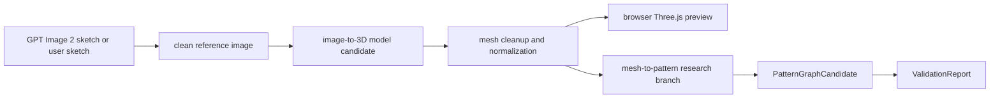

# AI Sketch And 3D Exploration Lanes

This note sketches three adjacent research lanes for the browser-native garment-pattern product:

1. Generate and edit garment sketches with `gpt-image-2`.
2. Interpolate garment sketches/images into 3D candidate geometry.
3. Build a visual corpus and evaluation bridge so generated sketches and 3D meshes can be judged against pattern truth.

The guiding rule remains unchanged: AI can propose intent and candidate geometry, but `PatternGraph` remains the manufacturing source of truth.

## Reference Snapshot

| Reference | Why it matters |
| --- | --- |
| OpenAI GPT Image 2 model page | `gpt-image-2` is documented as OpenAI's state-of-the-art image generation/editing model, accepting text and image inputs and producing images. |
| OpenAI image generation guide | Image generation can be used through Image API for one-shot generation/editing, or Responses API for conversational/multi-turn image workflows. |
| Amiko Simonetti Procreate guide | Useful visual style reference: fashion sketching as layered, intentional, editable 2D design communication. |
| FLORA | Fashion-sketch images paired with detailed text descriptions; useful for prompt style, vocabulary, and evaluation examples. |
| GarmageSet | Multimodal garment dataset with sketches/photos/text, 3D geometry, 2D pattern panels, and stitching topology. |
| TRELLIS / TRELLIS.2 | Current strong image-to-3D open-source direction; TRELLIS recommends image-conditioned generation over pure text-to-3D for better performance. |
| SPAR3D | Fast single-image reconstruction with point-cloud conditioning and mesh output; useful candidate for local 3D spikes. |
| Hunyuan3D-2 | Open 3D asset generation system with image-to-shape, multiview, texturing, API server examples, and low-VRAM modes. |
| TripoSR | Still useful historical baseline for fast single-image 3D reconstruction, but likely not the main state-of-art target anymore. |

Source links:

- OpenAI GPT Image 2: https://developers.openai.com/api/docs/models/gpt-image-2
- OpenAI image generation guide: https://developers.openai.com/api/docs/guides/image-generation
- Amiko Simonetti Procreate fashion sketch guide: https://www.amikosimonetti.com/life/elevate-sketches-procreate
- FLORA dataset: https://huggingface.co/datasets/CandleLabAI/FLORA
- GarmageSet dataset: https://huggingface.co/datasets/Style3D/GarmageSet
- TRELLIS: https://github.com/microsoft/TRELLIS
- TRELLIS.2: https://github.com/microsoft/TRELLIS.2
- SPAR3D: https://github.com/Stability-AI/stable-point-aware-3d
- Hunyuan3D-2: https://github.com/Tencent-Hunyuan/Hunyuan3D-2
- TripoSR announcement: https://stability.ai/news-updates/triposr-3d-generation

## Lane 1: Garment Sketch Creation With GPT Image 2

Goal: create a controlled visual corpus of fashion sketches and technical flats that downstream systems can understand, annotate, and eventually convert into patterns.

This lane is not just "make pretty fashion art." It should create image families with known semantic labels:

- croquis/front-body fashion sketches
- front/back technical flats
- construction-focused line drawings
- garment-on-figure sketches
- isolated garment sketches
- fabric and print variations
- pose/style variants
- ambiguity cases

### Product Use Cases

- Generate starter sketch references for the user.
- Create paired prompt/image/annotation fixtures for development.
- Produce style variations while holding construction constant.
- Create controlled ambiguity tests: same silhouette, different seams; same seams, different neckline; same dress, different fabric.
- Generate "bad input" examples for failure-mode training and manual annotation UX.

### Prompt Structure

Each generation should bind design intent to pattern-relevant semantics:

```text
garment_type:
view:
body_pose:
silhouette:
neckline:
armhole/sleeve:
closure:
waistline:
hem:
seams:
darts:
fabric_behavior:
render_style:
technical_constraints:
negative_constraints:
```

Example prompt family:

```text
Create a clean black-and-white fashion technical flat of a sleeveless A-line woven tunic dress, front view, center front on fold, scoop neckline, shoulder straps wide enough to cover undergarment straps, no sleeves, simple bust darts from side seam, side seams visible, knee length, modest hem sweep, no pockets, no zipper visible, no folds or dramatic pose, garment drawn flat as a manufacturing reference.
```

Companion prompt:

```text
Create the matching back-view technical flat for the same sleeveless A-line woven tunic dress. Preserve the same neckline depth relationship, shoulder width, side seam position, hem sweep, and dartless back. Draw clean vector-like black line art on white background.
```

### Image API vs Responses API

Use the Image API for single-shot fixture generation and batch prompt sweeps.

Use the Responses API when we want conversational image editing, such as:

- "make the neckline a square neckline but preserve all seams"
- "add a center-back zipper"
- "convert this fashion illustration into a technical flat"
- "generate front and back views in the same drawing style"

### Corpus Schema

```json
{
  "id": "sketch-a-line-tunic-0001",
  "model": "gpt-image-2",
  "prompt": "...",
  "view": "front",
  "garmentType": "sleeveless-a-line-tunic",
  "style": "technical-flat",
  "knownSemantics": {
    "neckline": "scoop",
    "sleeve": "sleeveless",
    "closure": "none-visible",
    "darts": ["front-side-bust-dart"],
    "seams": ["side-seam", "shoulder-seam"],
    "hem": "a-line-knee"
  },
  "pairedAssets": {
    "backView": "sketch-a-line-tunic-0001-back",
    "patternGraph": null,
    "measurementSet": null
  },
  "review": {
    "usableForSketchIntent": true,
    "usableForPatternGeneration": false,
    "notes": "Good technical flat; not yet a sewable pattern."
  }
}
```

### Evaluation Criteria

Generated sketches should be scored on:

- garment class clarity
- front/back consistency
- landmark visibility
- seam and dart visibility
- construction plausibility
- symmetry
- line cleanliness
- absence of hallucinated closures/pockets/details
- ease of manual tracing
- whether a patternmaker can infer drafting intent

## Lane 2: Sketch Or Image To 3D Candidate Geometry

Goal: evaluate whether current open 3D generators can turn garment sketches or generated reference images into useful 3D candidate meshes.

This lane should not promise sewing-pattern recovery. It should answer a narrower question:

> Can image-to-3D produce a candidate 3D garment shape useful for visualization, silhouette checking, or future mesh-to-pattern research?

### Candidate Frameworks

| Framework | Current read | Why evaluate |
| --- | --- | --- |
| TRELLIS | Official Microsoft repo for structured 3D latents; recommends image-conditioned generation for better performance than text-only. | Strong image-to-3D baseline; useful for prompt/image pipeline. |
| TRELLIS.2 | 4B large 3D generative model with sparse voxel representation and PBR materials. | Higher-fidelity asset candidate; likely heavier runtime. |
| SPAR3D | Official Stability AI codebase for fast feedforward single-image mesh reconstruction. | Good speed/editability candidate and closer to TripoSR lineage. |
| Hunyuan3D-2 | Large open 3D asset system with image-to-shape, multiview, texture generation, API server, and low-VRAM modes. | Practical local/server spike candidate with GLB output. |
| TripoSR | Fast single-image reconstruction from Tripo/Stability. | Baseline only; useful for comparing "stale but simple" against newer systems. |

### Product Pipeline



### What We Need From 3D Output

Minimum useful output:

- mesh or GLB/OBJ
- stable orientation
- garment-only segmentation if possible
- acceptable silhouette
- open/closed surface metadata if available
- front/back/side visible structure

Nice-to-have:

- UVs
- texture maps
- normals
- part segmentation
- garment-body separation
- editable point cloud or intermediate representation

Pattern-relevant needs that general image-to-3D probably will not solve by itself:

- panel topology
- seam relationships
- darts and shaping logic
- grainline
- seam allowance
- construction order
- flat pattern output

### Evaluation Harness

Use the same reference images across candidate systems:

1. GPT Image 2 technical flat, front view.
2. GPT Image 2 front/back pair combined as one reference sheet.
3. Croquis garment sketch on body.
4. Clean generated garment render.
5. Known pattern-derived render from our future prototype.

Score each output:

- silhouette preservation
- front/back plausibility
- garment-body separation
- mesh cleanliness
- editability
- import into Three.js
- import into Blender
- candidate value for mesh-to-pattern
- runtime cost
- license/commercial risk

### Recommended First Spike

Start with Hunyuan3D-2 and SPAR3D before TRELLIS.2.

Reason:

- Hunyuan3D-2 has explicit API server examples and low-VRAM paths.
- SPAR3D is designed for fast single-image reconstruction.
- TRELLIS.2 may be a better quality ceiling, but it is likely a heavier operational dependency.

TripoSR should be kept as a baseline if setup is trivial.

## Lane 3: Visual Corpus, Dataset Bridge, And Evaluation

Goal: build the connective tissue between generated sketches, 3D candidate meshes, and real sewing pattern output.

The danger in this project is optimizing for images that look right but cannot be made. This lane protects against that.

### Dataset Candidates

| Dataset | Useful signal | Risk |
| --- | --- | --- |
| FLORA | Sketch images with rich fashion descriptions. | Useful for sketch/prompt language, but not sewing-pattern truth. |
| GarmageSet | Multimodal garments with sketches/photos/text plus 3D geometry, 2D panels, and stitching topology. | License is noncommercial/no-derivatives; likely research/eval only. |
| GarmentCodeData | Large generated dataset with 3D garments and sewing patterns. | Synthetic, but strong for pattern/3D supervision. |
| SketchTailor dataset | Described as sketch-to-pattern/3D garment pattern dataset. | Need access/license research. |
| GarmentDiffusion data/code | Multimodal sewing-pattern generation from text/image/incomplete patterns. | Need exact availability and license check. |

### Our Own Corpus

Create a repo-local metadata index, but keep image files and dataset payloads out of normal commits unless tiny/licensed.

Corpus categories:

- `generated-sketches`: GPT Image 2 outputs with prompt metadata.
- `hand-reference`: user-created or licensed sketches.
- `technical-flats`: front/back garment flats.
- `pattern-fixtures`: known-valid `PatternGraph` examples.
- `renders`: generated 3D previews from known patterns.
- `image-to-3d-outputs`: model outputs from Hunyuan/SPAR3D/TRELLIS/etc.
- `failure-cases`: visually plausible but pattern-invalid examples.

### Evaluation Bridge

Every visual artifact should eventually link to one of three truth levels:

```text
Level 0: visual-only
  Image is useful as prompt/style/reference, but no pattern truth exists.

Level 1: semantic intent
  Image has reviewed SketchIntent, LandmarkSet, and garment metadata.

Level 2: pattern truth
  Image links to a PatternGraph, measurements, validation report, and expected flats.
```

This lets the project use GPT Image 2 aggressively without fooling itself.

## Product Architecture Implications

Add three optional branches to the browser-native pipeline:

```text
Text prompt
  -> GPT Image 2 generated sketch
  -> SketchIntent
  -> PatternGraph

Sketch or generated render
  -> image-to-3D model
  -> 3DGarmentMeshCandidate
  -> preview / mesh-to-pattern research

Visual corpus
  -> evaluation cases
  -> validation thresholds
  -> model/prompt iteration
```

New nodes for the knowledge graph:

- `GeneratedSketch`
- `PromptRecipe`
- `VisualCorpusItem`
- `SketchStyle`
- `ReferenceSheet`
- `ImageTo3DModelCandidate`
- `MeshCandidateReport`
- `CorpusTruthLevel`
- `SemanticReview`
- `PatternTruthLink`

## Near-Term Tasks

### Task 1: GPT Image 2 Sketch Corpus Spike

Deliverables:

- 25 prompt recipes for first-garment sketches.
- 5 generated front/back sketch pairs.
- Metadata JSON for each generated image.
- Manual review of which images are usable for `SketchIntent`.

### Task 2: Image-To-3D Candidate Spike

Deliverables:

- Install/test one fast local candidate: SPAR3D or Hunyuan3D-2 mini.
- Generate GLB/OBJ from 3-5 sketch/render inputs.
- Import outputs into Three.js and Blender.
- Write `docs/research/image-to-3d-candidate-spike.md`.

### Task 3: Corpus And Eval Schema

Deliverables:

- `docs/project/VISUAL-CORPUS-SCHEMA.md`
- `prototype/browser/fixtures/corpus-index.example.json`
- truth-level rubric
- visual-to-pattern review checklist

## Recommendation

The next ownable product step is not full automatic sketch-to-3D-to-pattern. It is a controlled sketch corpus and review loop:

```text
GPT Image 2 generated technical flats
  -> manual semantic review
  -> PatternGraph fixture
  -> Three.js preview
  -> generated flats
  -> comparison back to reference
```

This gives the project a data flywheel. Image-to-3D models should be evaluated in parallel, but only as candidate visual geometry until they can produce or preserve sewing structure.
