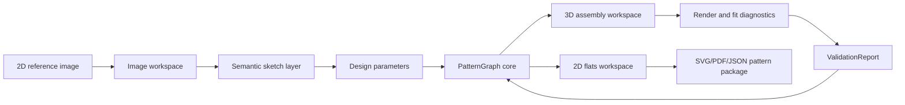

# Browser-Native Pipeline

This is the ownable lane: a web app that can go from 2D reference image to 3D garment model to 2D flats and a printable sewing pattern without depending on Blender, CLO, or a desktop CAD system as the runtime.

Blender remains a research and verification workbench. The browser-native product should own the interactive pipeline.

## Current Web Platform Read

| Layer | Current read | Product implication |
| --- | --- | --- |
| Three.js | `WebGPURenderer` is the modern renderer path and can fall back to WebGL 2. | Use Three.js first for shipping 3D UI, cameras, materials, glTF, picking, and fallback behavior. |
| WebGPU | Browser GPU API for high-performance rendering and general-purpose compute; MDN still flags it as not Baseline and secure-context only. | Use behind capability detection. Do not make it required for prototype 1. |
| WebAssembly | Good fit for deterministic geometry kernels and reused Rust/C++ libraries. | Put pattern math, curve operations, triangulation, and validation in WASM when JavaScript gets brittle or slow. |
| Web workers | Necessary for image preprocessing, geometry generation, validation, and future inference orchestration. | Keep the UI responsive; treat workers as the default for heavy computation. |
| WebGL 2 | Still the broad compatibility fallback. | Three.js/WebGL is acceptable for the first interactive 3D preview. |

Primary external references:

- Three.js WebGPU capability docs: https://threejs.org/docs/pages/WebGPU.html
- Three.js `WebGPURenderer` docs: https://threejs.org/docs/pages/WebGPURenderer.html
- Three.js WebGPU renderer manual: https://threejs.org/manual/en/webgpurenderer
- MDN WebGPU API: https://developer.mozilla.org/en-US/docs/Web/API/WebGPU_API
- W3C WebGPU spec: https://www.w3.org/TR/webgpu/
- Emscripten WebAssembly docs: https://emscripten.org/docs/compiling/WebAssembly.html

## Product Shape



The important inversion: the 3D model is not the source of truth. The source of truth is still `PatternGraph`.

The browser-native app should feel like one continuous studio, but internally it is several explicit workspaces:

1. Image workspace: upload, crop, calibrate scale, trace, mark body and garment landmarks.
2. Sketch semantics workspace: convert visible curves into `SketchIntent` and `LandmarkSet`.
3. Pattern workspace: generate and edit `PatternGraph`.
4. 3D workspace: preview the generated panels assembled around a simple avatar.
5. Flats workspace: inspect/export panel flats, seam allowance, notches, labels, cut counts, and construction notes.

## Architecture

```text
React or Svelte app shell
  -> Canvas 2D / SVG overlay for image annotation
  -> Three.js viewport for 3D preview
  -> PatternGraph store
  -> WASM geometry worker
  -> optional WebGPU compute worker
  -> export worker
```

Suggested package boundaries:

```text
prototype/browser/
  app/                  UI shell, panels, state, command history
  sketch/               image upload, calibration, tracing, landmark tools
  pattern-core/         PatternGraph schema, drafting rules, validation
  geometry-wasm/        Rust/WASM geometry kernels when needed
  preview-3d/           Three.js/WebGPU/WebGL preview runtime
  export/               SVG, PDF, JSON, tiled print package
  fixtures/             reference images, measurement sets, expected patterns
```

## Data Model Flow

### 1. Reference Image To Sketch Semantics

Input:

- raster image or vector SVG
- optional front/back pair
- optional body reference or measurement set

Intermediate objects:

- `ImageCalibration`: pixels per centimeter, pose orientation, front/back labels.
- `TraceLayer`: user or model-produced vector strokes.
- `LandmarkSet`: shoulders, neck, bust, waist, hip, hem, centerline, armhole, side seam, seam hints.
- `SketchIntent`: garment class, silhouette, neckline, length, ease impression, closure hints, seam hints.

Ownable browser implementation:

- Use Canvas 2D or WebGL texture for image display.
- Use SVG/Canvas overlay for landmarks and traced Beziers.
- Start with manual tracing and snapping. Add ML later.
- Use WebAssembly for robust curve simplification, path fitting, and length calculation if JS libraries are insufficient.

Prototype rule: manual annotation is acceptable. The first browser prototype should prove the representation and edit loop before promising automatic vision.

### 2. Sketch Semantics To PatternGraph

Input:

- `MeasurementSet`
- `SketchIntent`
- `LandmarkSet`
- first-garment drafting rules

Output:

- `PatternGraph`

The drafting engine should run in a deterministic worker. For prototype 1 it can be TypeScript; move to Rust/WASM if curve math, validation, or portability needs demand it.

PatternGraph must include:

- panels
- seam-line curves
- cut-line curves
- stitch relationships
- darts
- notches
- grainlines
- seam and hem allowances
- labels and cut counts
- validation report hooks

### 3. PatternGraph To 3D Model

There are two browser-native preview levels.

Level A: deterministic panel assembly preview.

- Convert each panel boundary to triangulated mesh.
- Position front/back panels around a simple parametric avatar.
- Connect seam-pair edges with visual stitch constraints.
- Show obvious seam mismatch, twist, wrong orientation, and collision.
- Render with Three.js.

Level B: lightweight cloth relaxation.

- Use a simple mass-spring or XPBD solver.
- Run in a Web Worker first.
- Move select constraint projection or collision broad-phase to WebGPU only if profiling proves it matters.
- Treat the result as diagnostic, not proof of fit.

For prototype 1, Level A is enough. A still, intelligible assembly preview is better than a fragile physics demo.

### 4. PatternGraph To Flats

This is the manufacturing output path.

Output surfaces:

- live 2D pattern canvas
- SVG export
- tiled PDF export
- JSON pattern package
- cut sheet
- construction order
- validation report

The flats view should expose:

- seam line vs cut line
- grainline
- notches and balance marks
- labels
- cut count
- fold lines
- seam allowance and hem allowance
- errors/warnings attached directly to geometry

This view must not be a UV unwrap. It is generated from `PatternGraph`.

## Three.js Role

Three.js should be the first 3D runtime because it buys a lot quickly:

- camera, orbit/pan/zoom, lights, materials
- raycasting and selection
- glTF import/export
- shape/curve visualization
- WebGL fallback through mature renderer paths
- WebGPU path through `WebGPURenderer` when available

Use Three.js for:

- 3D garment preview
- avatar display
- seam-pair visualization
- tension/validation overlays
- rendered screenshots for reports
- future WebGPU renderer experiments

Avoid using Three.js for:

- canonical pattern math
- schema validation
- sewing semantics
- source-of-truth panel geometry

## WebGPU Role

WebGPU is promising, but it should enter as acceleration, not architecture.

Good candidates:

- cloth solver constraint projection
- collision broad phase
- image preprocessing filters
- raster segmentation masks
- distance fields for sketch-to-silhouette
- heatmap/tension visualization
- large batch validation or synthetic data preview

Poor candidates for prototype 1:

- core pattern drafting
- seam semantics
- PDF/SVG export
- anything that must work in every browser immediately

Capability rule:

```text
if WebGPU available:
  use WebGPURenderer or GPU compute for optional acceleration
else:
  use WebGL 2 / CPU worker fallback
```

## WebAssembly Role

WASM is the right place for exact-ish geometry and long-lived kernels:

- Bezier flattening and arc length
- curve splitting and resampling
- offset curves for seam allowance
- polygon boolean operations
- triangulation
- self-intersection checks
- seam walking
- reflection/similarity scoring
- deterministic validation

Likely Rust candidates:

- `kurbo` for curves
- `lyon` for tessellation/path tooling
- `geo` or `geo-types` for geometry primitives
- Graphite's `vector-types` if the audit proves useful
- custom pattern-specific validation code

WASM should expose a narrow API, not leak implementation types into the app:

```ts
validatePattern(pattern: PatternGraph): ValidationReport
offsetPanel(panel: Panel, allowance: AllowanceRule): PanelOffsetResult
triangulatePanel(panel: Panel): MeshBuffers
resampleSeam(edge: SeamEdge, spacingMm: number): Point2[]
compareSeamPair(a: SeamEdge, b: SeamEdge): SeamPairReport
```

## Ownable Pipeline Milestones

### M1: Browser Pattern Studio Skeleton

Goal: browser app with image upload, landmark annotation, pattern JSON, flats canvas, and placeholder 3D viewport.

Deliverables:

- `prototype/browser` app skeleton
- `PatternGraph` TypeScript schema
- fixture measurement set
- manual landmark tool
- saved project JSON

### M2: First Garment Generator In Browser

Goal: generate sleeveless A-line tunic panels from measurements and manual landmarks.

Deliverables:

- front/back panel generation
- seam lines and cut lines
- seam allowance
- notches, grainlines, labels
- SVG export
- validation report

### M3: Three.js Assembly Preview

Goal: show pattern panels as a coarse assembled garment around a simple avatar.

Deliverables:

- panel triangulation
- Three.js scene
- avatar primitive
- panel placement
- seam-pair visual links
- front/back/side camera presets
- PNG screenshot export

### M4: WASM Geometry Kernel

Goal: move fragile geometry into a deterministic worker.

Deliverables:

- Rust/WASM package
- offset curve spike
- triangulation spike
- seam length validation
- self-intersection validation
- TypeScript bindings

### M5: Diagnostic 3D Relaxation

Goal: add a lightweight solver after static assembly works.

Deliverables:

- worker-based mass-spring or XPBD prototype
- pinned seam constraints
- simple avatar collision
- tension/strain heatmap
- documented limitations

### M6: WebGPU Acceleration Spike

Goal: decide whether WebGPU is worth owning yet.

Deliverables:

- WebGPU capability detection
- Three.js `WebGPURenderer` path with WebGL fallback
- one compute experiment: image mask, distance field, or cloth constraint batch
- performance comparison against CPU/WASM worker

## Prototype Recommendation

Start with a Three.js plus TypeScript app. Add WASM when geometry gets sharp. Add WebGPU after the static preview and validation are already useful.

The simplest credible first browser prototype is:

```text
manual 2D reference annotation
  -> PatternGraph JSON
  -> 2D flats SVG/PDF
  -> Three.js static 3D assembly preview
  -> validation report
```

That path is ownable, shippable, and honest. It proves the product loop without betting the farm on browser cloth physics or automatic sketch understanding too early.

## Research Questions

- Which curve representation should be canonical: cubic Beziers, line/arc segments, or a normalized polyline plus source curve?
- Should the drafting engine be TypeScript first, Rust/WASM first, or generated from a neutral schema?
- What semantic SVG conventions can roundtrip through Graphite, browser editors, and export?
- How simple can the avatar be before fit diagnostics become misleading?
- Which checks must block export versus merely warn?
- Can WebGPU compute meaningfully improve cloth preview or image preprocessing enough to justify complexity?
- Can the app remain useful offline with local storage / OPFS project files?
