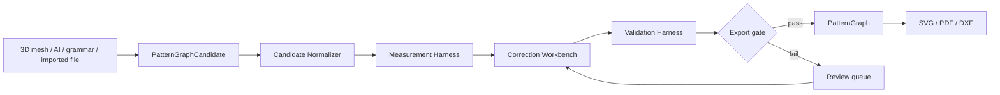

# Candidate-To-Export Interop Layer

This is the missing layer between research output and an exportable pattern file.

Inputs can come from:

- pattern grammar
- the `Computational Pattern Making from 3D Garment Models` branch
- image/sketch-to-3D models
- GarmentCode-style pattern programs
- user-edited browser flats
- imported SVG/DXF/pattern diagrams

Outputs can become:

- canonical `PatternGraph`
- corrected `PatternGraphRevision`
- SVG
- tiled PDF
- DXF/AAMA/ASTM later
- tech-pack/cut-sheet metadata

The interop layer exists because a candidate can look plausible and still fail as a pattern. It must measure, correct, test, and prove the candidate before export.

## Position In The Pipeline



The important contract:

```text
PatternGraphCandidate is allowed to be incomplete.
PatternGraph is not.
```

No candidate should export directly. It must pass through:

1. normalization
2. measurement
3. correction
4. validation
5. export conformance
6. round-trip test

## Candidate Types

### Mesh-Derived Candidate

Source examples:

- 2202.10272 computational pattern-making pipeline
- user seam hints on 3D garment mesh
- AI image-to-3D mesh followed by flattening
- Blender or browser mesh edits

Likely issues:

- UV islands instead of sewable panels
- missing seam semantics
- missing grainline
- missing allowances
- too many corners
- poor panel symmetry
- nonmatching seam lengths
- unclear darts or accidental cuts
- no construction order

### Pattern-Program Candidate

Source examples:

- GarmentCode-style generated patterns
- FreeSewing/OpenPattern-style parametric outputs
- our own drafting engine

Likely issues:

- schema mismatch
- missing export labels
- formula-generated curves that need trueing
- measurement assumptions not recorded
- garment-family correctness not checked

### Visual/AI Candidate

Source examples:

- GPT Image 2 generated flats
- sketch-to-pattern model
- GarmentDiffusion-style output
- raster pattern encodings decoded to vectors

Likely issues:

- visually plausible fake pattern markings
- disconnected pieces
- seams that do not correspond to visible garment construction
- no scale
- no body measurement link
- no fabric/ease assumptions

### Imported File Candidate

Source examples:

- SVG from Graphite/Inkscape/browser editor
- future DXF/AAMA/ASTM
- scanned or traced pattern reference

Likely issues:

- layers and semantic names lost
- units ambiguous
- transforms applied silently
- cut lines mixed with seam lines
- no stitch relationships
- no validation metadata

## Candidate Normalizer

Goal: convert messy inputs into a typed `PatternGraphCandidate`.

Required outputs:

- normalized units, preferably millimeters
- stable coordinate system
- panel candidates
- boundary curves
- source provenance
- confidence scores
- missing-field list
- source-to-candidate trace map

Normalization tasks:

- detect closed panel boundaries
- distinguish seam lines, cut lines, construction lines, labels, and markings
- infer or ask for scale
- assign panel ids
- preserve source layer names where possible
- map 3D mesh patches or UV islands to panel candidates
- record confidence and ambiguity

## Measurement Harness

Goal: measure candidate geometry before correction.

Required measurements:

- panel area
- panel perimeter
- corner count
- curve lengths
- edge lengths
- seam-pair length difference
- dart leg length difference
- notch positions along seam
- grainline angle
- foldline location
- allowance offset distance
- self-intersection count
- bounding box and print footprint
- scale consistency

3D-specific measurements:

- mesh patch area vs flattened area
- flattening distortion
- boundary correspondence
- seam reflection/symmetry score
- curvature/deformation concentration
- patch-to-body orientation
- avatar clearance
- collision/intersection count

Garment-family measurements:

- expected panel-role coverage
- expected construction-feature coverage
- suspicious omissions
- optional feature detection
- pattern-reference similarity class

## Correction Workbench

Goal: turn a candidate into a valid `PatternGraphRevision`.

Correction can be automatic, assisted, or manual.

Automatic corrections:

- snap seam-pair endpoints
- equalize paired seam lengths within tolerance
- reorder edge direction
- close tiny gaps
- remove duplicate vertices
- smooth noisy curves
- simplify excessive corners
- add seam allowance from seam line
- derive cut line from allowance rule
- assign default grainlines
- add missing labels and cut counts

Assisted corrections:

- choose whether an open edge is finished, folded, or paired
- choose garment family / variant
- assign panel roles
- confirm dart vs accidental wedge
- resolve center-back closure vs cut-on-fold
- choose facing vs binding for neckline/armhole
- decide whether seam mismatch is easing/gathering or error

Manual corrections:

- edit panel curves
- split or merge panels
- redraw seam pair
- add/remove dart
- move notch
- rotate grainline
- override allowance

Correction must produce a revision trail:

```json
{
  "revisionId": "rev-003",
  "sourceCandidate": "candidate-001",
  "operations": [
    {
      "type": "equalize-seam-length",
      "target": "side-seam-front-to-back",
      "beforeMm": [721.2, 716.9],
      "afterMm": [719.1, 719.1],
      "mode": "assisted",
      "approvedBy": "human"
    }
  ]
}
```

## Validation Harness

Validation should run after every correction and before every export.

### Hard Errors

These block export:

- panel boundary is not closed
- cut line self-intersects
- paired seams differ beyond allowed tolerance
- required panel role missing
- seam pair references missing edge
- grainline missing on main fabric panel
- cut count missing
- scale unknown
- source license forbids export/use
- seam allowance missing for an exported sewing edge
- dart legs do not meet at a valid dart tip

### Warnings

These require review but may not block export:

- high panel corner count
- nonstandard construction for selected garment family
- asymmetry where symmetry was expected
- unusual grainline angle
- large flattening distortion
- optional facing/binding not selected
- high fabric deformation budget
- 3D preview collision
- missing pattern-reference match

### Informational Checks

- area by panel
- total fabric estimate
- print page count
- marker/nesting estimate
- construction feature list
- inferred garment family

## Export Conformance

Export is not just writing paths.

Every exported file should be generated from a passed `PatternGraph`, not from a candidate.

### SVG Conformance

Required:

- physical units
- viewBox and page metadata
- semantic groups/layers
- seam line and cut line separation
- labels as text
- grainline
- notches
- foldline
- cut count
- validation summary metadata

### PDF Conformance

Required:

- scale square
- tiled page layout if needed
- page labels
- assembly/cut sheet
- validation summary
- known limitations

### DXF/AAMA/ASTM Conformance

Future required:

- layer mapping
- piece names
- grade rules if present
- seam/cut/internal-line classification
- notches and drill points
- fabric/fold metadata where supported
- import test into at least one external tool

## Round-Trip Tests

A pattern export should be testable after writing.

Minimum tests:

- export SVG
- reimport SVG into candidate normalizer
- compare panel count
- compare panel ids/names
- compare seam-line length within tolerance
- compare cut-line length within tolerance
- compare notch counts and positions
- compare grainline presence/angle
- compare bounding boxes and scale square

Future DXF tests:

- export DXF
- reimport DXF through our parser or an external verifier
- compare layer semantics
- compare piece geometry
- compare markings

## Proposed Schema Additions

```text
PatternGraphCandidate
CandidateProvenance
CandidateNormalizerReport
MeasurementReport
CorrectionOperation
CorrectionWorkbenchState
ExportGateReport
ExportConformanceReport
RoundTripReport
InteropFormatProfile
ToleranceProfile
```

## Tolerance Profile

Prototype tolerances should be explicit and editable.

Suggested starting point:

| Check | Prototype tolerance |
| --- | --- |
| paired seam length | max 3 mm or 0.5%, whichever is larger |
| notch position on paired seams | max 3 mm |
| dart-leg length difference | max 2 mm |
| panel closure gap | max 1 mm before auto-close |
| scale-square error | max 0.5 mm over 100 mm |
| grainline angle deviation | warning over 5 degrees from expected |
| high corner count | warning over 8 meaningful corners for simple prototype panels |

These are starting heuristics, not production claims.

## First Prototype Scope

For prototype 1, implement the interop layer for browser-native `PatternGraphCandidate` only:

```text
candidate JSON
  -> normalize units/panels/edges
  -> measure seam lengths, corners, grainlines, allowance presence
  -> correct tiny gaps and seam direction
  -> validate hard errors/warnings
  -> export SVG
  -> reimport SVG
  -> round-trip report
```

The 2202.10272 mesh-derived route should target this same contract later:

```text
3DGarmentMesh
  -> ComputationalPatternMakingPipeline
  -> PatternGraphCandidate
  -> Candidate-To-Export Interop
  -> PatternGraph
  -> SVG/PDF/DXF
```

## Research Questions

- What should be the minimum viable `PatternGraphCandidate` schema?
- Which correction operations can safely run automatically?
- Which operations must require human approval?
- How do we preserve source provenance through export?
- What DXF dialect is the first serious target?
- Can we use a public pattern-reference corpus to generate garment-family correctness rules?
- Which external tool can serve as a DXF import verifier?
- How do we display validation failures directly on 2D flats and 3D preview?
