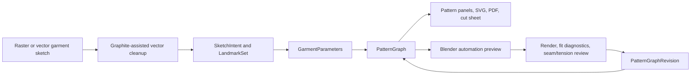

# Graphite + Blender Pipeline Notes

This note captures the local setup and the product implications of pulling Graphite and Blender into the project orbit.

## Local Setup

External source checkouts live under `external/`, which is intentionally ignored by git.

| Tool | Local path | Upstream | Checkout | Status |
| --- | --- | --- | --- | --- |
| Graphite | `external/Graphite` | `https://github.com/GraphiteEditor/Graphite.git` | `b27b4c6` on `master` | Clean checkout; frontend dependencies installed. |
| Blender source | `external/blender` | `https://github.com/blender/blender.git` | `9b81403e` on `main` | Clean shallow checkout with `GIT_LFS_SKIP_SMUDGE=1`. |
| Blender app | `/Applications/Blender.app` and `/opt/homebrew/bin/blender` | Homebrew cask | Blender 5.1.1 | Installed and version-verified. |

Installed local toolchain:

```text
cargo 1.95.0
wasm-pack 0.14.0
cargo-watch 8.5.3
node v25.3.0
pnpm 10.28.0
blender 5.1.1
```

Graphite setup performed:

```bash
cd external/Graphite/frontend
npm run setup
cargo metadata --no-deps --format-version 1
```

Blender source setup note: cloning from the GitHub mirror can trip Git LFS asset downloads. The reliable shallow source checkout is:

```bash
GIT_LFS_SKIP_SMUDGE=1 git clone --depth 1 https://github.com/blender/blender.git external/blender
```

## Core Position

Graphite and Blender are workbenches, not the product source of truth.

`PatternGraph` should remain the authoritative garment representation. Graphite can help users create and edit vector intent; Blender can help generate, inspect, render, and simulate 3D candidates. Neither a Graphite document graph nor a Blender mesh should become the canonical sewing pattern.



## Graphite: Best Uses

Graphite is a strong candidate for the 2D side because it is already a vector/raster editor with a nondestructive node graph. Its repo is especially interesting in these areas:

| Need | Useful Graphite area | Why it matters |
| --- | --- | --- |
| Vector sketch cleanup | `node-graph/libraries/vector-types` | Contains subpaths, Beziers, vector attributes, intersections, offsetting, splines, and path operations. |
| Nondestructive transformations | `node-graph/graph-craft` and `node-graph/interpreted-executor` | The document graph model can inspire a reversible garment-edit history. |
| User-facing vector editor | `frontend`, `editor`, `desktop` | Useful reference for a web-first annotation and correction interface. |
| Procedural vector generation | `node-graph/nodes/vector`, `node-graph/nodes/path-bool`, `node-graph/nodes/transform` | Could prototype pattern drafting operations as visual nodes. |
| SVG ecosystem | `resvg`, `usvg`, `kurbo`, `vello`, `lyon_geom`, `polycool` dependencies | These are promising Rust geometry/rendering dependencies for pattern paths and previews. |
| Graph execution | `node-graph/README.md` and `graph-craft/src/document.rs` | The node architecture maps nicely to drafting formulas and transform chains. |

Graphite should be explored first as inspiration and possible dependency extraction, not as a fork target. The highest-value borrow is its vector/path stack and node-graph idioms.

Possible pipeline roles:

- Convert a loose sketch into clean semantic curves: neckline, armhole, centerline, side seam, hem, seam hints.
- Provide a manual correction UI for `LandmarkSet`.
- Offer nondestructive style edits: lengthen, flare, move neckline, rotate dart, adjust hem.
- Show pattern-generation steps as a visible graph: measurements -> block -> transform -> seam allowance -> export.
- Export canonical SVG from `PatternGraph`, while preserving labels and metadata from our own schema.

Things to avoid:

- Do not store garment truth only inside Graphite's document model.
- Do not equate arbitrary vector layers with sewable pattern panels.
- Do not commit to a full Graphite fork until the first garment pattern schema exists.

## Blender: Best Uses

Blender is the right local 3D workbench because it brings Python automation, mesh tools, curves, UV tools, cloth physics, rendering, imports/exports, and a scriptable UI. Its source tree confirms relevant areas:

| Need | Useful Blender area | Why it matters |
| --- | --- | --- |
| Headless 3D automation | `bpy` Python API, `scripts`, `doc/python_api/examples` | Generate avatars, panels, seams, renders, and reports from scripts. |
| SVG import | `scripts/addons_core/io_curve_svg` | Can ingest vector sketches or pattern SVGs as curves for layout and inspection. |
| Mesh construction | `bmesh`, mesh examples, import/export tests | Build coarse garment meshes from panels and inspect mesh validity. |
| UV/flattening references | `intern/slim`, UV editor/source groups | Useful for parameterization experiments, but still not a sewing-pattern substitute. |
| Cloth and physics | `tests/python/physics_cloth.py`, physics operators | Useful for preview and stress/failure discovery, not final proof of fit. |
| Rendering | EEVEE/Cycles, Freestyle, camera automation | Produce review images and visual diffs for generated garments. |
| Geometry Nodes | source/tests/assets | Later candidate for procedural avatar/garment previews. |
| Interchange | OBJ, PLY, glTF, USD, SVG add-ons/tests | Good bridge between generated data and third-party tools. |

Blender should be used through scripts first. A full Blender source build is unnecessary for the first prototype; the installed Blender app gives us `bpy` and headless rendering now.

Possible pipeline roles:

- Generate a parametric avatar from `MeasurementSet`.
- Import `PatternGraph` panels as curves or mesh strips around the avatar.
- Build a coarse 3D assembly from panels and seam pairs.
- Render front/back/side diagnostic views.
- Export glTF/OBJ previews for a browser viewer.
- Test cloth drape heuristics and surface obvious failures.
- Provide a future mesh-to-pattern research workbench for the 2202.10272 pipeline.

Things to avoid:

- Do not treat UV unwrap output as production flats.
- Do not make cloth simulation the only validation gate.
- Do not require building Blender from source unless we need engine-level modifications.

## Future Pipeline Shape

The most useful future architecture is a four-workbench loop:

```text
Graphite-like 2D workbench
  -> clean curves, landmarks, style hints, manual annotation

PatternGraph core
  -> drafting, panels, seam pairs, allowances, labels, construction order

Blender automation workbench
  -> avatar, assembly preview, cloth/render diagnostics, mesh experiments

Export/review surface
  -> SVG/PDF/JSON, guide sheet, validation report, human review edits
```

The loop should be explicit:

1. Sketch input becomes `SketchIntent`, not a pattern.
2. Vector cleanup creates `LandmarkSet` and seam hints.
3. Drafting creates a `PatternGraph`.
4. Graph validation checks sewing logic before 3D preview.
5. Blender generates a visual assembly and diagnostic render.
6. Failures return as `ValidationReport` entries and `PatternGraphRevision`, not ad hoc mesh edits.
7. Approved patterns export as SVG/PDF/JSON and later DXF.

## Near-Term Spikes

### Spike 1: Graphite Vector Audit

Goal: prove whether Graphite's vector crates can serve our pattern path needs.

Tasks:

- Audit `vector-types` for Bezier serialization, intersections, path length, offset path, and curve splitting.
- Run focused Rust tests for subpath/offset/intersection behavior.
- Decide whether to use Graphite crates directly, copy patterns, or choose smaller geometry libraries.

Output: `docs/research/graphite-vector-audit.md`

### Spike 2: Blender Headless Pattern Preview

Goal: script a no-human Blender preview from a tiny pattern JSON fixture.

Tasks:

- Create a minimal `PatternGraph` fixture for a sleeveless front/back panel pair.
- Write a Blender Python script that creates panel curves, simple avatar blocks, seam labels, and a rendered PNG.
- Export glTF/OBJ from the assembled preview.
- Record what geometry must be in the schema for Blender automation to work cleanly.

Output: `docs/research/blender-headless-preview-spike.md`

### Spike 3: SVG Roundtrip

Goal: test whether Graphite-generated or hand-authored SVG can roundtrip into the pattern pipeline and Blender.

Tasks:

- Create an SVG with semantic layer names for neckline, armhole, side seam, hem, centerline, and body landmarks.
- Parse it into `SketchIntent` and `LandmarkSet`.
- Import the same SVG into Blender via `io_curve_svg`.
- Compare coordinate systems, units, transforms, and layer/group preservation.

Output: `docs/research/svg-roundtrip-spike.md`

## Decision For Prototype 1

Prototype 1 should not integrate deeply with Graphite or Blender internals yet.

Use Graphite as reference and possible vector-library source. Use Blender as a headless preview/render target. Keep the first implementation centered on:

```text
manual sketch/vector landmarks
  -> PatternGraph JSON
  -> SVG/PDF flats
  -> Blender diagnostic preview
```

This gives us real 2D-to-3D feedback without letting either external tool swallow the garment-pattern product.
